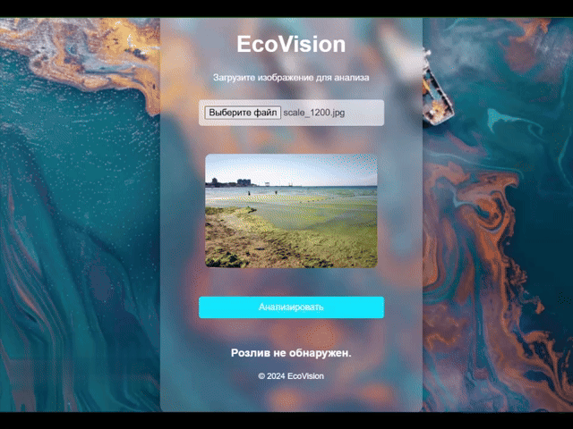

# Проект "Детектор розлива нефти"

## Содержание

1. [Описание](#описание)
2. [Основной функционал](#основной-функционал)
3. [Используемые технологии](#используемые-технологии)
    - [Фронтенд](#фронтенд)
    - [Бэкенд](#бэкенд)
    - [Зависимости](#зависимости)
4. [Установка и запуск](#установка-и-запуск)
    - [Клонирование репозитория](#1-клонирование-репозитория)
    - [Установка зависимостей](#2-установка-зависимостей)
    - [Запуск серверной части](#3-запуск-серверной-части)
    - [Открытие клиентской части](#4-открытие-клиентской-части)
    - [Конфигурирование приложения](#5-конфигурирование-приложения)
5. [Как использовать](#как-использовать)
6. [Структура проекта](#структура-проекта)
7. [Пример результата](#пример-результата)
8. [Примечания](#примечания)


## Описание

Веб-приложение для анализа изображений на наличие разливов нефти с использованием модели машинного обучения. Пользователь загружает изображение, которое обрабатывается сервером, возвращая результат: "Розлив обнаружен" или "Розлив не обнаружен".

## Основной функционал

- Загрузка изображений через веб-интерфейс.
- Отображение загруженного изображения перед анализом.
- Обработка изображения сервером с использованием предварительно обученной модели.
- Возврат результата анализа пользователю.

## Используемые технологии

### Фронтенд

- HTML5, CSS3
- JavaScript (Vanilla JS)

### Бэкенд

- Flask (Python)
- TensorFlow/Keras для модели машинного обучения
- OpenCV и Pillow для обработки изображений

### Зависимости

- Flask
- Flask-CORS
- TensorFlow
- Keras
- OpenCV
- Pillow
- NumPy
- PyYAML

## Установка и запуск

### 1. Клонирование репозитория

Скачайте датасет, проект и перейдите в папку с ним:

Датасет: https://www.kaggle.com/datasets/vighneshanand/oil-spill-dataset-binary-image-classification

```bash
git clone https://github.com/JarikDev/oil_spill_detector.git
cd <папка проекта>
```

### 2. Установка зависимостей

Установите необходимые библиотеки из файла `requirements.txt`:

```bash
pip install -r requirements.txt
```

### 3. Запуск серверной части

Выполните команду для запуска Flask-приложения, предварительно настроив в yaml файле пути к динным:

```bash
python app.py
```

Сервер запустится по адресу `http://localhost:7788`.
Внимание сервер запускается довольно долго, т.к. в начале идет обучение модели

### 4. Открытие клиентской части

Перейдите по ссылке `http://localhost:7788/upload`

### 5. Конфигурирование приложения

Приложение содержит файл `config.yaml`. Можно задать значение порта, на котором будет подниматься приложение, а также путь к датасету.

```Yaml
app:
  port: 8080
datasets:
  train: path\to_train\set
  validation: path\to_validation\set
  test: path\to_test\set
```

## Как использовать

1. Нажмите кнопку "Загрузите изображение" и выберите фотографию.
2. Нажмите "Проанализировать", чтобы отправить фотографию на сервер.
3. Результат отобразится под кнопкой (например, "Розлив обнаружен!" или "Розлив не обнаружен.").

## Пример результата

- **Обнаружен розлив.**: Модель определила наличие разлива нефти.
- **Розлив не обнаружен.**: На изображении разливов нет.
- **Ошибка при анализе изображения.**: Возникла ошибка при загрузке или обработке.


